# yubi-key

## 入力方法

1. 左手で入力モード選択
2. 右手でキーを選択
3. 左手をベースポジションに戻すことで入力確定

## 指配置

### 左手

| 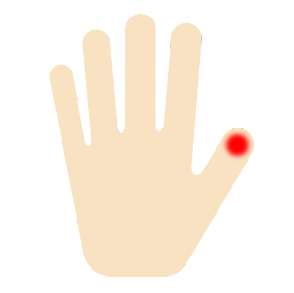 | 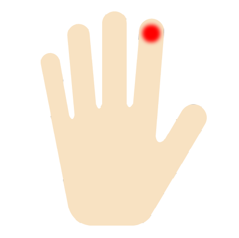 | 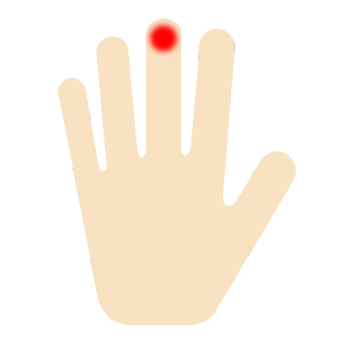 | 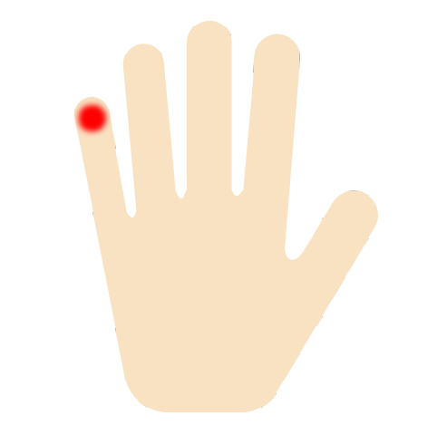 |
| :---: | :---: | :---: | :---: |
| [enter] | [layer2] | [layer3] | [delete] |

### 右手

|  | 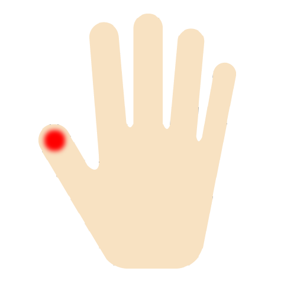 | 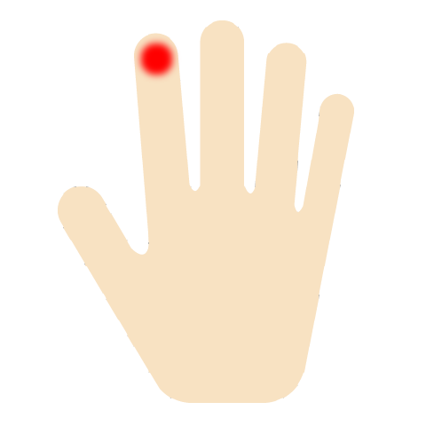 | 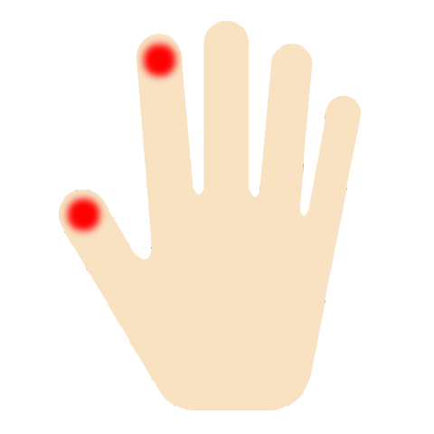 | 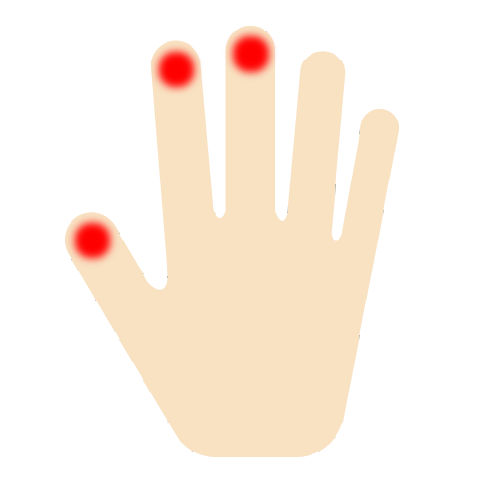 | 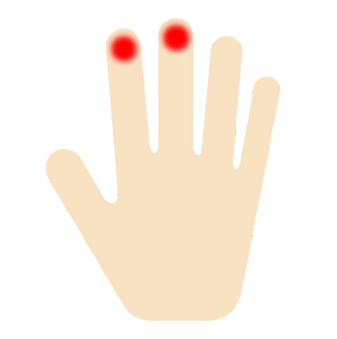 |
| :---: | :---: | :---: | :---: | :---: | :---: |
| layer1 | a | e | o | t | r |
| layer2 | h | i | y | l | m |
| layer3 | ' | , | ? | ! | - |

|  | 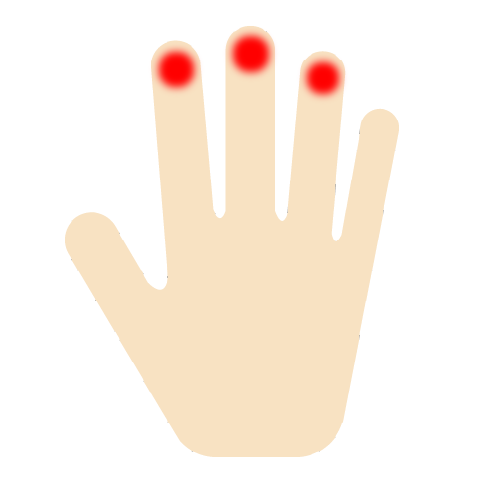 | 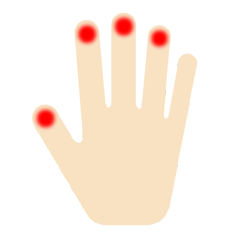 | 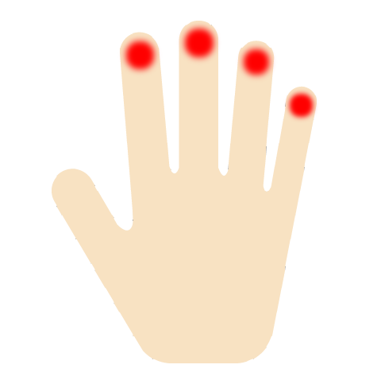 | 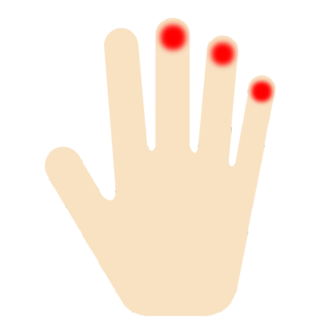 | 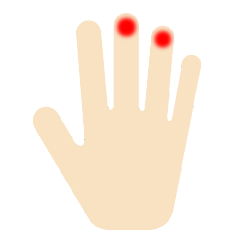 |
| :---: | :---: | :---: | :---: | :---: | :---: |
| layer1 | s | u | d | b | c |
| layer2 | n | w | f | g | k |
| layer3 | p | v | j | x | z |

|  | 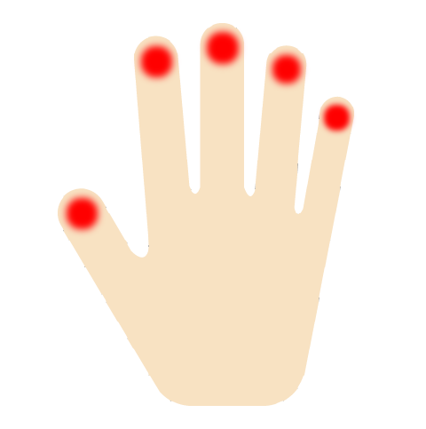 |
| :---: | :---: |
| layer1 | [space] |
| layer2 | \n |

```
# id

0	左手	小指
1		薬指
2		中指
3		人差し指
4		親指
5	右手	親指
6		人差し指
7		中指
8		薬指
9		小指


# left hand

00000		base position

00001		入力
00010		レイヤー２


# right hand

00000		base position

10000	○
01000	○
00100	○
00001	△

11000	○
10100	△
10001	○
01100	○
01001	○
00110	○
00101	△

11100	○
11001	○
01110	○
01101	○
00111	○

11110	○
01111	○

11111		GPT or command
```

| left  | ID  | Function |
| ----  | --- | ----     |
| 00000 | 0   |          |
| 00001 | 1   | [enter]  |
| 00010 | 2   | [layer2] |
| 00100 | 3   | [layer3] |
| 10000 | 4   | [delete] |

| right | ID  | layer1  | layer2 | layer3 |
| ----  | --- | ----    | ---    | ---    |
| 00000 | 0   |         |        |        |
| 10000 | 1   | a       | h      | '      |
| 01000 | 2   | e       | i      | ,      |
| 11000 | 3   | o       | y      | ?      |
| 11100 | 4   | t       | l      | !      |
| 01100 | 5   | r       | m      | -      |
| 01110 | 6   | s       | n      | p      |
| 11110 | 7   | u       | w      | v      |
| 01111 | 8   | d       | f      | j      |
| 00111 | 9   | b       | g      | x      |
| 00110 | 10  | c       | k      | z      |
| 11111 | 11  | [space] | \n     |
|       |     |         |        |
| 00100 | 12  |         |        |
| 00001 | 13  |         |        |
| 10100 | 14  |         |        |
| 10001 | 15  |         |        |
| 01001 | 16  |         |        |
| 00101 | 17  |         |        |
| 11001 | 18  |         |        |
| 01101 | 19  |         |        |
|       |     |         |        |
